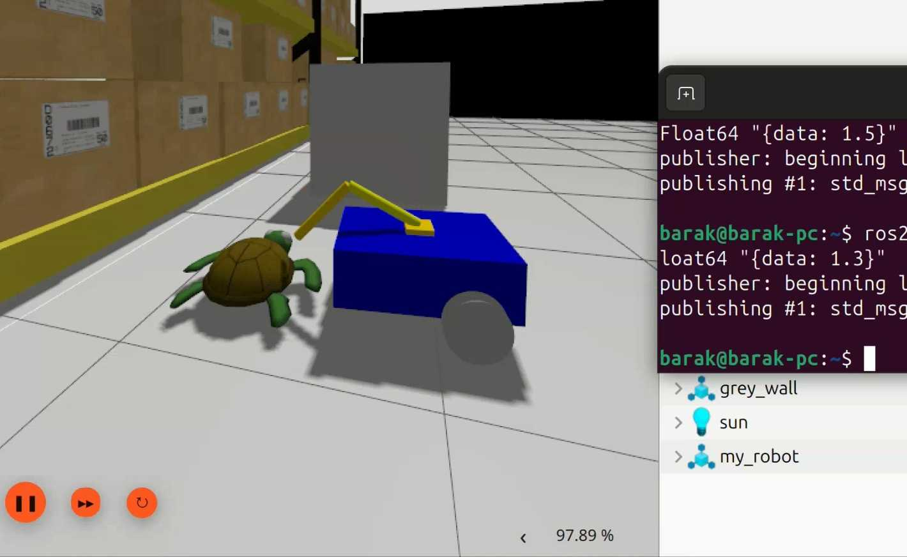

# ROS2 and Simulation Intro

Welcome to **ROS2 and Simulation Intro**! This repository is a hands-on project designed **purely for learning purposes**—nothing production-grade. You’ll build a simple mobile robot and robotic arm model, visualize them in RViz, and run them in Gazebo Harmonic (8.9).

If you’re new to robotics or just starting with ROS2, this README will guide you step-by-step.



---

## 📂 Project Structure

```
ROS2_and_simulation_intro/
├── my_robot_description/      # Robot model definitions and RViz configs
│   ├── urdf/                  # XACRO files for robot and arm
│   ├── rviz/                  # RViz visualization settings
│   └── launch/                # RViz launch files
├── my_robot_bringup/          # Gazebo simulation setup
│   ├── worlds/                # Custom Gazebo world (.sdf)
│   ├── config/                # ros_gz_bridge YAML mappings
│   └── launch/                # Gazebo launch files
└── README.md                  # This file
```

---

## 📝 Prerequisites

Before you begin, ensure you have:

1. **Ubuntu 24.04** (or compatible distro)
2. **ROS2 Jazzy Jellyfish**
3. **Gazebo Harmonic (8.9)**
4. **ros_gz_interface / ros_gz_bridge**
5. **colcon** and **rosdep**

Install dependencies:

```bash
sudo apt update
sudo apt install -y   ros-jazzy-desktop   ros-jazzy-gazebo-ros-pkgs   ros-jazzy-ros-gz-bridge   python3-colcon-common-extensions   python3-rosdep
sudo rosdep init && rosdep update
```

---

## ⚙️ Installation & Build

1. **Clone the repo**

   ```bash
git clone https://github.com/yourusername/ROS2_and_simulation_intro.git
cd ROS2_and_simulation_intro
```

2. **Install ROS2 package dependencies**

   ```bash
rosdep install --from-path src --ignore-src -r -y
```

3. **Build the workspace**

   ```bash
colcon build --symlink-install
```

4. **Source the install setup**

   ```bash
source install/setup.bash
```

---

## 🚀 Running the Demos

1. **Visualize the full robot in RViz**

   ```bash
ros2 launch my_robot_description display.launch.py
```

2. **Visualize only the robotic arm**

   ```bash
ros2 launch my_robot_description arm_display.launch.xml
```

3. **Spawn the mobile robot in Gazebo**

   ```bash
ros2 launch my_robot_bringup my_robot_gazebo.launch.xml
```

4. **Spawn the arm in Gazebo**

   ```bash
ros2 launch my_robot_bringup my_arm_gazebo.launch.xml
```

---

## 🤖 ROS2 Concepts Primer

- **Node**: A process performing computation (e.g., Gazebo-ROS bridge).
- **Topic**: A named channel for message exchange (e.g., `/cmd_vel`).
- **Message**: The data structure passed on topics.
- **Launch File**: A script (.py or .xml) to start multiple nodes.

You will see these in action when running the demos.

---

## 🌐 Gazebo Simulation Details

- **World**: Defined in `my_robot_bringup/worlds/test_world.sdf`, containing a flat plane.
- **Models**: URDF/XACRO files under `my_robot_description/urdf/` define geometry and joints.
- **Bridge**: YAML files in `my_robot_bringup/config/` map Gazebo topics to ROS2 topics via `ros_gz_bridge`.

---